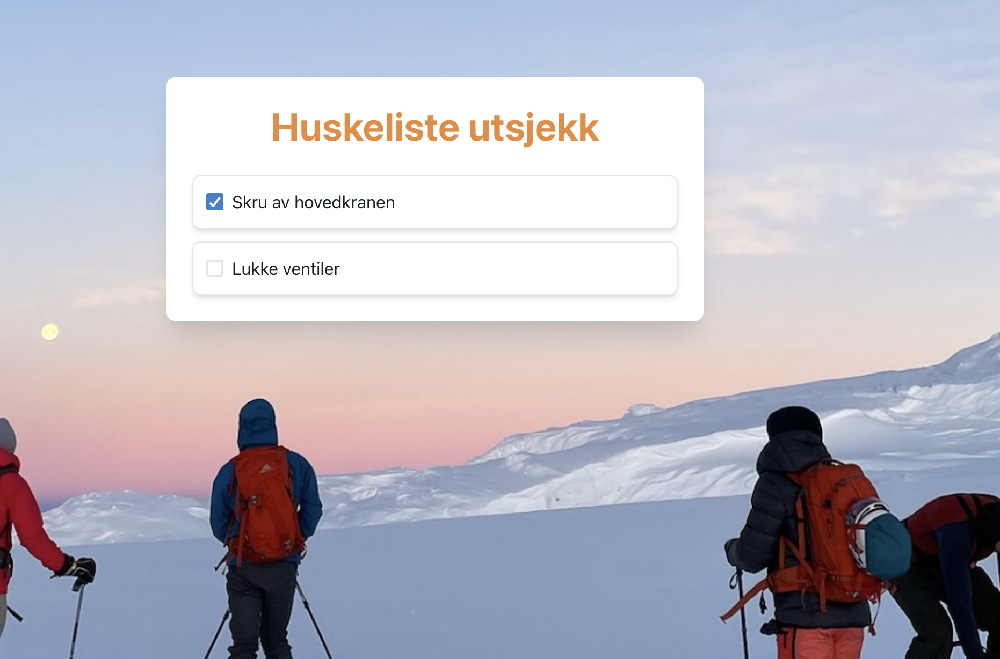
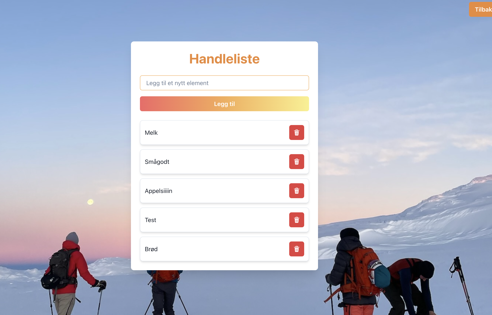
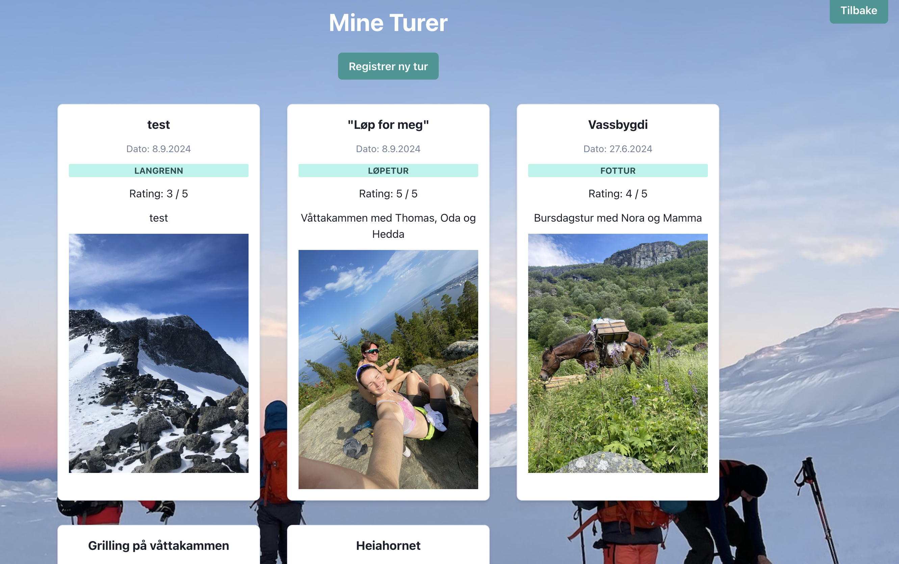
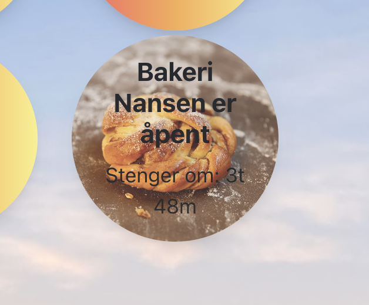
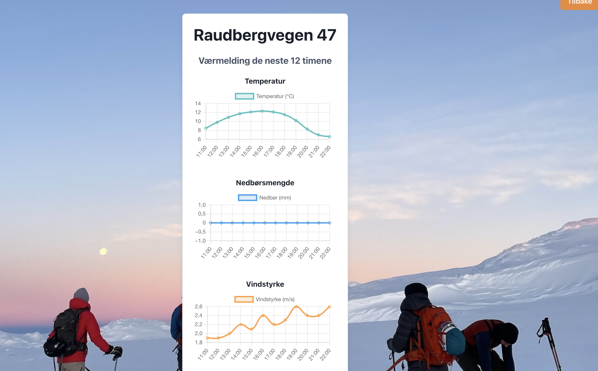

# Hytteside 🛖
En nettside som gjør det enkelt å overvåke og administrere hytteaktiviteter. Siden skal bidra til å gi brukerne av hytta en litt smidigere opplevelse⭐️

Siden er under produksjon, men følgende funksjonalitet er implementert så langt💃🏼
### Funksjonaliteter
1. **Sjekkliste for utsjekk✅:**
Hold orden på alt som må gjøres før du forlater hytten.

3. **Handleliste🛒🍜**
Legg til ting som mangler på hytten, slik at den neste som kommer opp vet hva som trengs. Se listen i sanntid og kryss av når varer er handlet inn.

4. **Registrering av turer i nærområdet🏔️🥾**
Skriv beskrivelser, gi turene du har gått en vurdering og last opp bilde fra turen.

6. **Oversikt over tidligere turer📚⛰️**
7. 

8. **Nedtelling til bakeriets åpning🍰**
Vis en nedtelling til når det lokale bakeriet åpner eller stenger.

10. **Værmelding for hytta🌧️🌈**
Få oppdatert værmelding fra YR basert på hyttens koordinater.

## Teknisk
### Database
#### MongoDB
All data om brukere, sjekkliste, handlelister og turer lagres i en MongoDB-database. 
#### API
YR sitt vær-API
#### Frontend
React.js og Chakra UI
#### Backend
Node.js og Express  
Backend bygget med Node.js og Express for å håndtere API-kall, lagring og oppdatering av informasjon, samt kommunikasjon med databasen og eksterne API-er.

